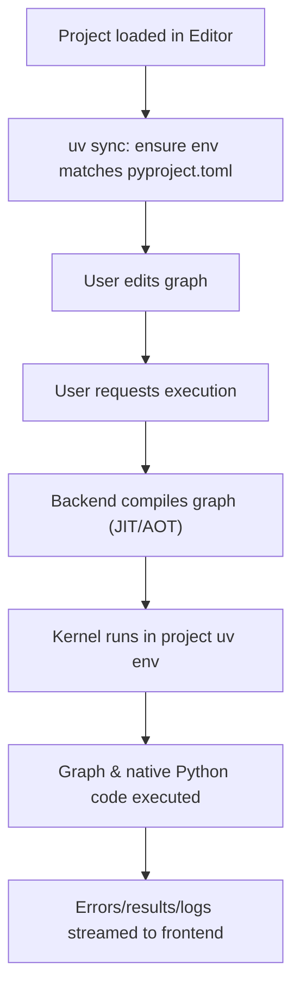

# Ramen Execution Model

## Overview
Ramen executes computational graphs by compiling them to Python bytecode and running them in isolated, uv-managed virtual environments. The Ramen kernel, graph, and any native Python code all run within the same environment, ensuring reproducibility and isolation.

---

## Kernel and Environment
- **Project Isolation:** Each project has its own uv-managed virtual environment.
- **Kernel Location:** The Ramen kernel is installed and runs inside the project’s virtual environment.
- **Execution Context:**
  - All graph execution, plugin/topping loading, and native Python code run within this environment.
  - Ensures complete isolation of dependencies and reproducibility for each project.

---

## Execution Flow

1. **Project Load/Switch (Editor):**
    - The Ramen Editor runs `uv sync` to ensure the environment matches `pyproject.toml` and Ramen’s requirements.
    - All dependencies and toppings are installed/updated as needed.
2. **Graph Compilation:**
    - The backend compiles the graph (JIT or AOT) to Python bytecode.
3. **Environment Validation:**
    - The API assumes the environment is already correct. If not, execution will fail with an import or runtime error.
4. **Kernel Launch:**
    - The Ramen kernel is started within the project’s environment.
5. **Graph Execution:**
    - The compiled graph and any native Python code are executed by the kernel.
    - All code runs in the same isolated environment.

---

## Error Handling and Reporting
- **Error Propagation:**
  - Any error or exception that occurs during graph execution (including within nodes, edges, or native code) is captured by the kernel.
  - Errors are passed out to the backend and streamed to the frontend in real time.
  - The user receives detailed error messages, including stack traces and node/edge context where possible.
- **User Feedback:**
  - Errors are displayed in the frontend’s execution console/log area.
  - The user can inspect, debug, and re-run the graph after fixing issues.

---

## Resource Management and Isolation
- **Environment Isolation:** Each project’s execution is fully isolated from others.
- **Resource Limits (Optional/Future):** The system may support CPU/memory/time limits per execution to prevent runaway processes.
- **Cleanup:** After execution, resources are released and the environment is left in a clean state.

---

## Execution Modes
- **JIT (Just-In-Time):** Graphs can be modified and executed on the fly.
- **AOT (Ahead-Of-Time):** Graphs can be compiled and cached for faster repeated execution.

---

## Execution Flow Diagram

--- 