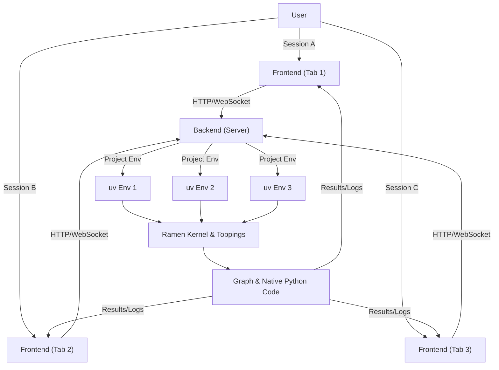
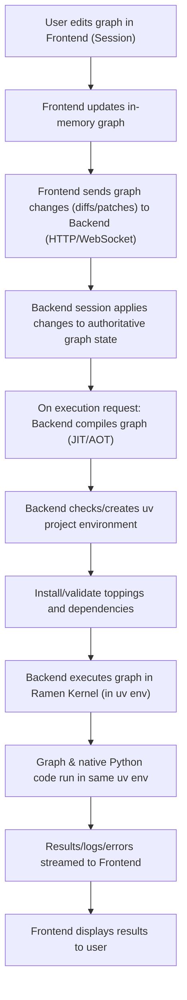

# Ramen Project Technical Design

## Overview

Ramen is a next-generation visual programming environment for Python. It enables users to design, compile, and execute computational graphs using an intuitive node-based interface. Ramen graphs are compiled/JIT-compiled into Python bytecode and executed in isolated, reproducible Python environments managed by `uv`.

## Goals
- Provide an intuitive, node-based interface for constructing complex workflows.
- Compile/JIT graphs into efficient Python bytecode for high performance.
- Execute graphs in isolated, reproducible Python environments managed by `uv`.
- Support seamless integration of native Python code and third-party libraries via a plugin ("topping") system.
- Enable command-line execution for production deployment, automation, and CI/CD integration.
- Ensure reproducibility, modularity, and extensibility for data science, automation, and educational use cases.

## Architecture

### High-Level Architecture Diagram

### Component Breakdown

| Component         | Language/Tech      | Responsibilities                                                                 |
|-------------------|-------------------|----------------------------------------------------------------------------------|
| Frontend          | React, TypeScript | Graph editor, user interface, communicates with backend                           |
| Backend Core      | Python            | Graph parsing, compilation/JIT, AOT caching, execution, API, environment management           |
| Ramen Kernel      | Python            | Runtime for executing graphs and native code in isolated env                      |
| Toppings          | Python            | Extend graph/node capabilities, provide new operations                            |
| uv                | Python            | Manages project environments and dependencies                                     |

### Data Flow

### Session Model
- Each graph can only have one active session at a time.
- If a user attempts to open a graph already in use, they are prompted to terminate the existing session or cancel.
- Prevents conflicting edits and ensures graph state consistency.

### Deployment
- **Visual Development**: Run locally (localhost) or as a remote server for graph editing
- **Production Execution**: Command-line execution (`ramen-cli run`) for headless deployment
- **VSCode Integration**: Planned extension for IDE-based development
- Same codebase and architecture across all deployment modes
- All features (project isolation, toppings, etc.) available in both GUI and CLI modes 