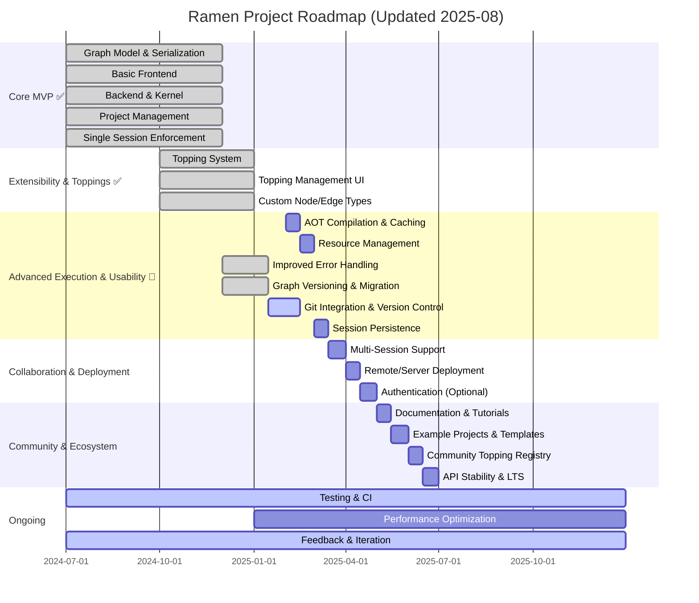

# Ramen Project Roadmap

## Phase 1: Core MVP ✅ COMPLETED

- [x] **Graph Model & Serialization**
  - ✅ Implemented node, edge, port, and graph data structures
  - ✅ JSON-based serialization/deserialization with RamenGraphFile format
  - ✅ Versioning support with schema migration tools

- [x] **Basic Frontend**
  - ✅ Node-based graph editor with React + @xyflow/react
  - ✅ VSCode extension with custom editor for .ramen files
  - ✅ Drag-and-drop node library and property panels

- [x] **Backend & Kernel**
  - ✅ Graph parsing and in-memory representation
  - ✅ JIT compilation to Python bytecode
  - ✅ Execution engine in uv-managed environment
  - ✅ Real-time WebSocket communication for execution updates

- [x] **Project Management**
  - ✅ VSCode workspace integration
  - ✅ Automatic uv environment management
  - ✅ Project dependency tracking

- [x] **Single Session Enforcement**
  - ✅ Session manager with graph locking
  - ✅ Session takeover prompts for conflicting access

---

## Phase 2: Extensibility & Toppings ✅ COMPLETED

- [x] **Topping System**
  - ✅ Comprehensive ToppingBase API with NodeFunction and NodeMetadata
  - ✅ Entry points system for automatic topping discovery
  - ✅ 196+ built-in nodes across 10 namespaces
  - ✅ Modular toppings: numpy, pandas, torch, plots, nn-builder

- [x] **Topping Management UI**
  - ✅ Node library panel with topping categorization
  - ✅ Dynamic topping loading and error handling
  - ✅ Integrated dependency management with uv

- [x] **Custom Node/Edge Types**
  - ✅ Full support for user-defined nodes via toppings
  - ✅ Extensible type system with TypeRegistry
  - ✅ Custom port definitions and metadata

---

## Phase 3: Advanced Execution & Usability 🚧 IN PROGRESS

- [ ] **AOT Compilation & Caching**
  - Ahead-of-time compilation for faster repeated execution
  - Bytecode caching with graph hash versioning

- [ ] **Resource Management**
  - Optional CPU/memory/time limits per execution
  - Process isolation and monitoring

- [x] **Improved Error Handling** 
  - ✅ Node/edge context in error messages via WebSocket streaming
  - ✅ Real-time execution status and error propagation
  - ✅ VSCode integrated error display and debugging

- [x] **Graph Versioning & Migration**
  - ✅ Schema version tracking in GraphMetadata
  - ✅ Migration tools for format compatibility
  - ✅ Backward compatibility support

- [x] **Git Integration & Version Control** ✅ COMPLETED
  - ✅ Semantic diff system for .ramen files
  - ✅ Node-level change detection and analysis
  - ✅ VSCode Git integration commands (diff, status, log)
  - ✅ REST API for graph diff computation
  - ✅ Visual diff viewer with HTML webview
  - [ ] Conflict resolution for graph merging (Phase 3 next)
  - [ ] Graph history and version comparison UI (Phase 3 next)

- [ ] **Frontend Components with Toppings** 🆕 NEW FEATURE
  - Package-bundled frontend components for rich UI nodes
  - React components distributed with topping packages
  - Automatic component discovery from installed toppings
  - Custom UI elements for data visualization and interaction
  - Self-contained topping architecture (backend + frontend)

- [ ] **Session Persistence**
  - Restore session state after browser refresh/crash
  - Persistent execution contexts

---

## Phase 4: Collaboration & Deployment

- [ ] **Multi-Session Support**
  - Multiple projects open in different tabs
  - Real-time updates for session state

- [ ] **Remote/Server Deployment**
  - CLI/server mode for remote access
  - Configurable host/port

- [ ] **Authentication (Optional/Future)**
  - If needed, add basic user authentication for remote deployments

---

## Phase 5: Community & Ecosystem

- [ ] **Documentation & Tutorials**
  - User guide, developer guide, topping/plugin guide

- [ ] **Example Projects & Templates**
  - Pre-built graphs for common data science/ML tasks

- [ ] **Community Topping Registry**
  - Discover and share toppings/plugins

- [ ] **API Stability & LTS**
  - Freeze core APIs, provide long-term support

---

## Ongoing

- [ ] **Testing & CI**
  - Automated tests for frontend, backend, and toppings
  - Continuous integration setup

- [ ] **Performance Optimization**
  - Profiling and tuning for large graphs and heavy workloads

- [ ] **Feedback & Iteration**
  - Gather user feedback, iterate on features and UX

---

## Visual Roadmap (Mermaid)

