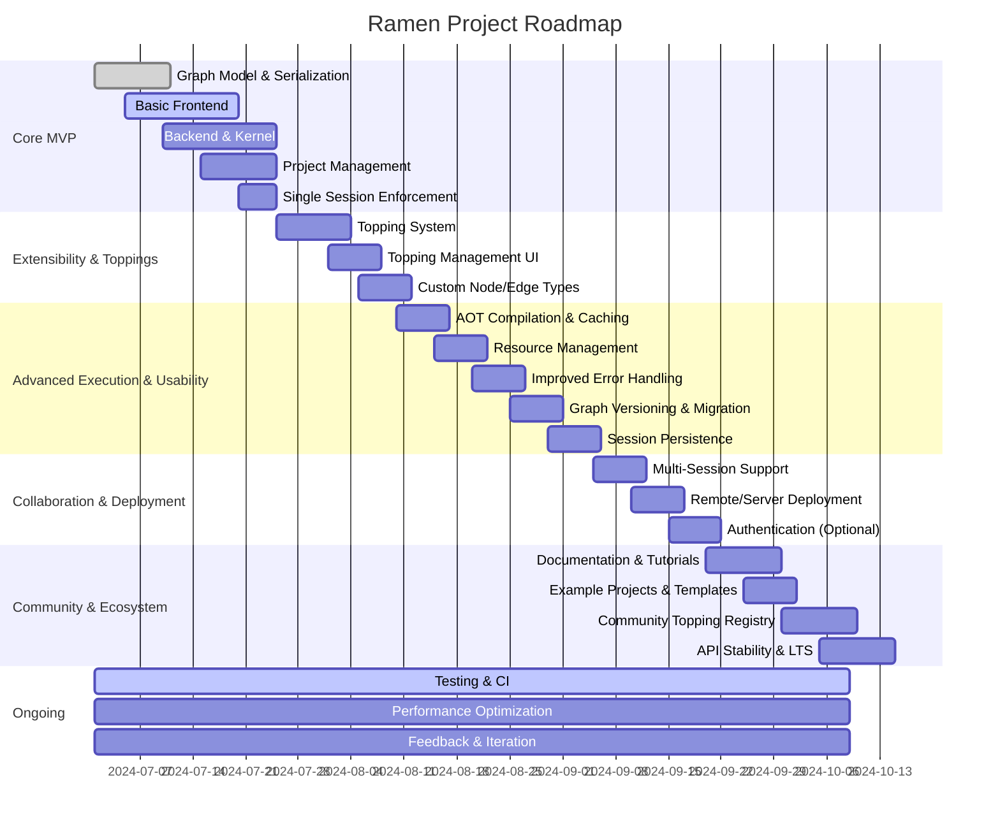

# Ramen Project Roadmap

## Phase 1: Core MVP

- [ ] **Graph Model & Serialization**
  - Implement node, edge, port, and graph data structures
  - JSON-based serialization/deserialization
  - Versioning support

- [ ] **Basic Frontend**
  - Node-based graph editor (add, move, connect nodes)
  - Project open/save (local)
  - Minimal UI/UX polish

- [ ] **Backend & Kernel**
  - Graph parsing and in-memory representation
  - JIT compilation to Python bytecode
  - Execution engine in uv-managed environment
  - Error propagation to frontend

- [ ] **Project Management**
  - Create/open/switch projects
  - `uv sync` integration on project load

- [ ] **Single Session Enforcement**
  - Only one session per graph, with session takeover prompt

---

## Phase 2: Extensibility & Toppings

- [ ] **Topping System**
  - Plugin API for registering new node/edge types
  - Runtime loading of toppings from project environment
  - Example toppings: numpy, pandas, torch, plots

- [ ] **Topping Management UI**
  - Install/uninstall toppings from frontend
  - List available/active toppings

- [ ] **Custom Node/Edge Types**
  - Support for user-defined nodes/edges via toppings

---

## Phase 3: Advanced Execution & Usability

- [ ] **AOT Compilation & Caching**
  - Ahead-of-time compilation for faster repeated execution

- [ ] **Resource Management**
  - Optional CPU/memory/time limits per execution

- [ ] **Improved Error Handling**
  - Node/edge context in error messages
  - UI for error inspection and debugging

- [ ] **Graph Versioning & Migration**
  - Tools for upgrading graph schemas

- [ ] **Session Persistence**
  - Restore session state after browser refresh/crash

---

## Phase 4: Collaboration & Deployment

- [ ] **Multi-Session Support**
  - Multiple projects open in different tabs
  - Real-time updates for session state

- [ ] **Remote/Server Deployment**
  - CLI/server mode for remote access
  - Configurable host/port

- [ ] **Authentication (Optional/Future)**
  - If needed, add basic user authentication for remote deployments

---

## Phase 5: Community & Ecosystem

- [ ] **Documentation & Tutorials**
  - User guide, developer guide, topping/plugin guide

- [ ] **Example Projects & Templates**
  - Pre-built graphs for common data science/ML tasks

- [ ] **Community Topping Registry**
  - Discover and share toppings/plugins

- [ ] **API Stability & LTS**
  - Freeze core APIs, provide long-term support

---

## Ongoing

- [ ] **Testing & CI**
  - Automated tests for frontend, backend, and toppings
  - Continuous integration setup

- [ ] **Performance Optimization**
  - Profiling and tuning for large graphs and heavy workloads

- [ ] **Feedback & Iteration**
  - Gather user feedback, iterate on features and UX

---

## Visual Roadmap (Mermaid)

